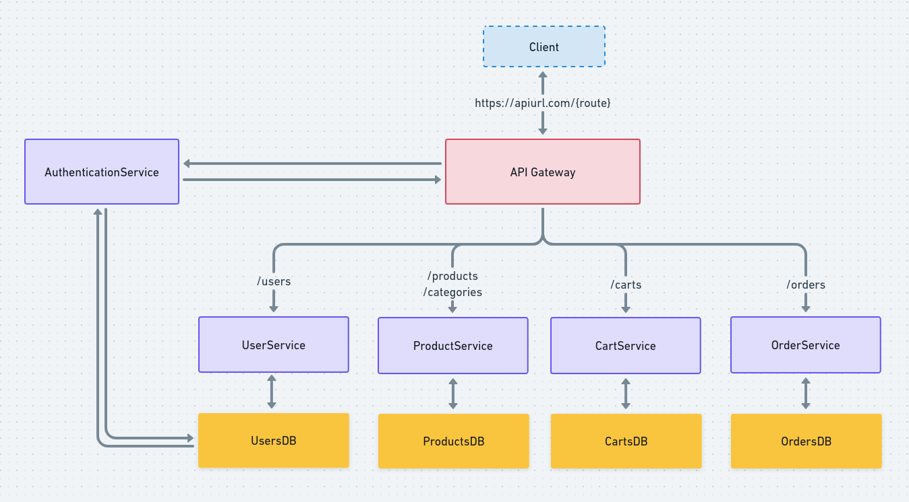

# Project Overview

  

# Database Overview

  

# Getting Started

## :rocket: Getting started with Docker
1. Install docker: https://docs.docker.com/get-docker/
2. Install docker-compose: https://docs.docker.com/compose/install/
3. Clone this repo: `git clone https://github.com/erickivel/E-commerce.git`
4. Move to the directory: `cd E-commerce`
5. Move to services: `cd services`
6. Move to your desired service (Authentication or Cart or Product or User)
6. Rename the file `.env.development.example` to `.env.development` and change the variables if you want
7. Run `docker-compose up` to builds, creates, starts and attaches the containers
8. The server runs on: http://localhost:3333

To stop and removes the containers, run `docker-compose down` 

Note: If `docker-compose up` or `docker-compose down` doesn't work run respectively `sudo docker-compose up` or `sudo docker-compose down`
