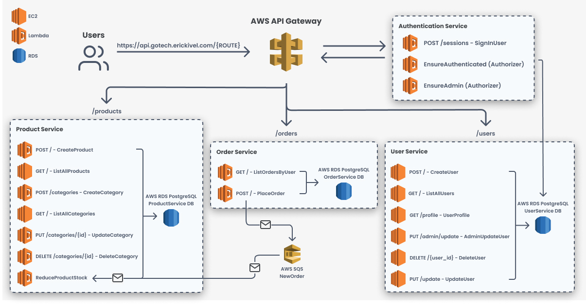

<h1 align="center">
    
</h1>

  <a href="#question-about">About</a>&nbsp;&nbsp;&nbsp;|&nbsp;&nbsp;&nbsp;
  <a href="#gear-technologies">Technologies</a>&nbsp;&nbsp;&nbsp;|&nbsp;&nbsp;&nbsp;
  <a href="#rocket-getting-started-with-docker">Getting Started</a>&nbsp;&nbsp;&nbsp;|&nbsp;&nbsp;&nbsp;
  <a href="#memo-license">License</a>

# Project Overview:

  

---

  

## :question: About

Go!Tech is an e-commerce of computer peripherals made with NodeJS

I developed this app in order to apply the new things that I learned, like: microservices, AWS services and serverless.

## :gear: Technologies

**These are the technologies that I used to develop this application:**

⌨️ <strong>Typescript</strong> —> Extends JavaScript by adding types;  
⚙️ <strong>NodeJS</strong> —> A platform for building network applications; 
🌐 <strong>Express</strong> —> Web framework for Node.js 
⚙️ <strong>Serverless Framework</strong> —> The Easy & Open
Way To Build Serverless Apps; 
🔧 <strong>Jest and Supertest</strong> —> Used to test the application; 
📚 <strong>Prisma</strong> —> Used to manage databases; 
📚 <strong>Postgres</strong> —> Database 
🌐 <strong>JSON Web Token</strong> —> Used to manage the tokens (Example: authentication); 

 

## :rocket: Getting Started With Docker

1. Install docker: https://docs.docker.com/get-docker/
2. Install docker-compose: https://docs.docker.com/compose/install/
3. Clone this repo: `git clone https://github.com/erickivel/E-commerce.git`
4. Move to the directory: `cd E-commerce`
5. Move to services: `cd services`
6. Move to your desired service (UserService, ProductService or OrderService)
6. Rename the file `.env.development.example` to `.env.development` and change the variables if you want
7. Run `docker-compose up` to builds, creates, starts and attaches the containers
8. The server runs on: http://localhost:3333

To stop and removes the containers, run `docker-compose down` 

Note: If `docker-compose up` or `docker-compose down` doesn't work run respectively `sudo docker-compose up` or `sudo docker-compose down`

## :memo: License

This project is licensed under the **MIT License** - see the [LICENSE](LICENSE) file for details.